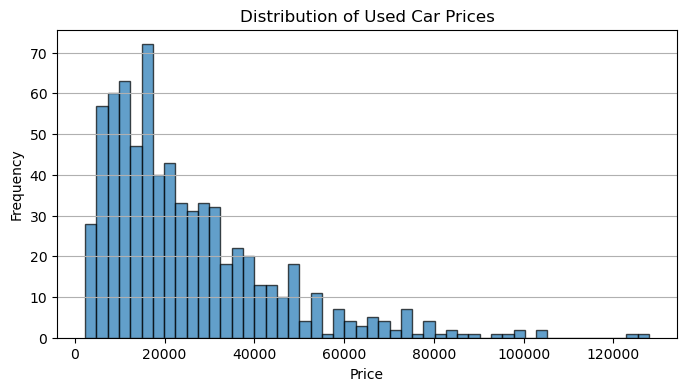
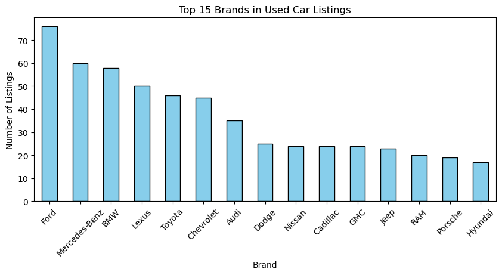
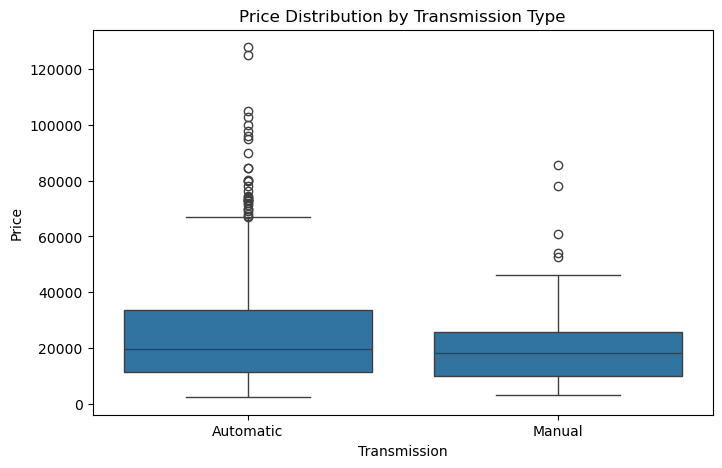
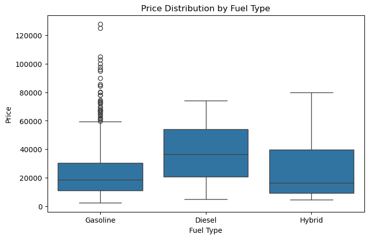
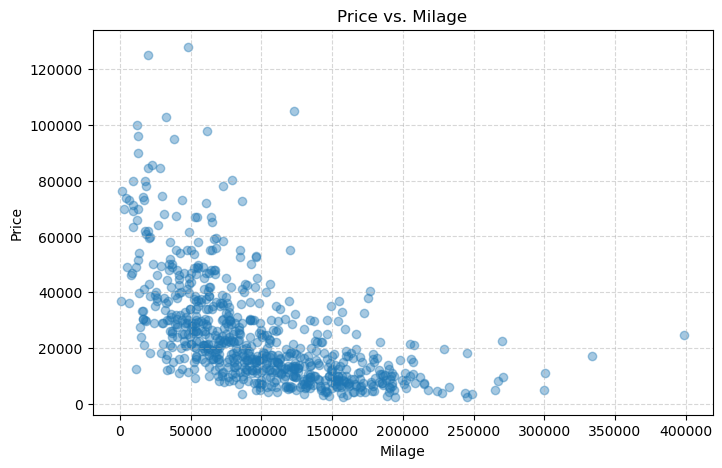
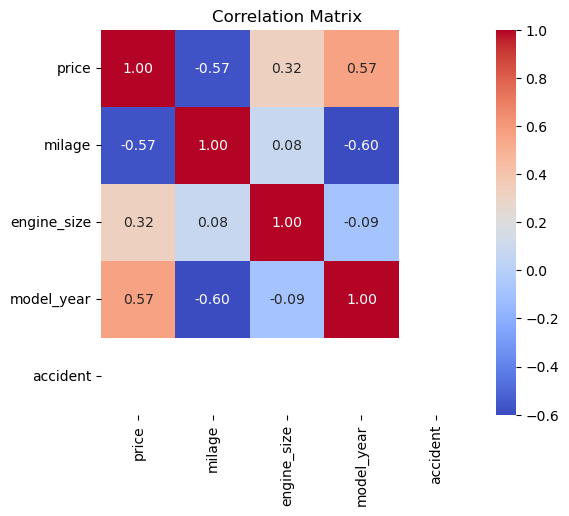
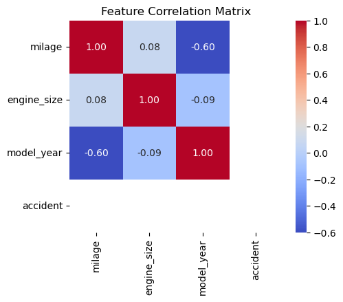
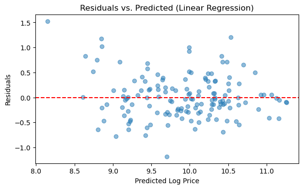
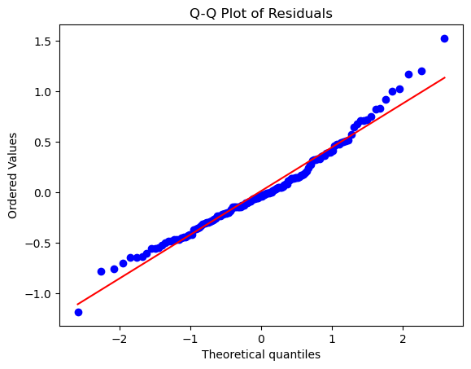
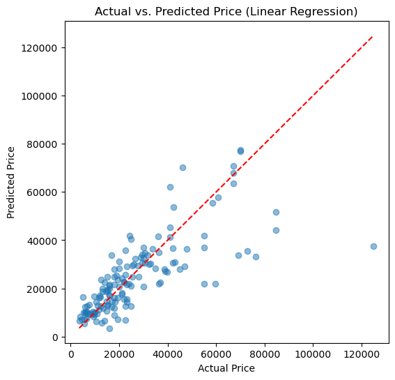

# 🚗 Used Car Price Analytics & Predictive Modeling

Unlocking insights from real-world used car listings with end-to-end data science.

---

🌟 **Project Highlights**

- **Full pipeline:** Data cleaning → EDA → Feature engineering → Statistical testing → Predictive modeling → Business insights
- **Goal:** Predict car prices and uncover what drives value in the used car market
- **Tech:** Python, Pandas, scikit-learn, XGBoost, imblearn, SHAP, Matplotlib, Seaborn

---

**In this project, you'll see:**
- Clean, structured code and interactive outputs
- Clear explanations with a business focus
- Ready-to-use analytics for dashboards or product teams


## 📚 Table of Contents

- 🗂️ [Step 1: Dataset & Table Structure](#step-1-dataset--table-structure)
- 🧹 [Step 2: Data Cleaning Pipeline](#step-2-data-cleaning-pipeline)
- 📊 [Step 3: Exploratory Data Analysis (EDA)](#step-3-exploratory-data-analysis-eda)
- 🏗️ [Step 4: Feature Engineering](#step-4-feature-engineering)
- 📉 [Step 5: Statistical Analysis & Hypothesis Testing](#step-5-statistical-analysis--hypothesis-testing)
- 🔗 [Step 6: Correlation & Multicollinearity Check](#step-6-correlation--multicollinearity-check)
- 🤖 [Step 7: Predictive Modeling: Car Price Estimation](#step-7-predictive-modeling-car-price-estimation)
- 🧪 [Step 8: Model Diagnostics & Validation](#step-8-model-diagnostics--validation)
- 📊 [Step 9: Actual vs. Predicted Price (Test Results)](#actual-vs-predicted-price)
- 📝 [Step 10: Business Insights & Recommendations](#step-10-business-insights--recommendations)


# 🗂️ Step 1: Dataset & Table Structure

## 1.1 Load and Preview Data

We'll start by loading the raw dataset and inspecting the first few rows to understand its basic structure.


```python
import pandas as pd

df = pd.read_excel('used_cars.xlsx')
df.head()
```


<div>
<style scoped>
    .dataframe tbody tr th:only-of-type {
        vertical-align: middle;
    }

    .dataframe tbody tr th {
        vertical-align: top;
    }

    .dataframe thead th {
        text-align: right;
    }
</style>
<table border="1" class="dataframe">
  <thead>
    <tr style="text-align: right;">
      <th></th>
      <th>brand</th>
      <th>model</th>
      <th>model_year</th>
      <th>milage</th>
      <th>fuel_type</th>
      <th>engine</th>
      <th>transmission</th>
      <th>Color</th>
      <th>accident</th>
      <th>price</th>
    </tr>
  </thead>
  <tbody>
    <tr>
      <th>0</th>
      <td>Ford</td>
      <td>Utility Police Interceptor Base</td>
      <td>2013</td>
      <td>51,000 mi.</td>
      <td>E85 Flex Fuel</td>
      <td>300.0HP 3.7L V6 Cylinder Engine Flex Fuel Capa...</td>
      <td>6-Speed A/T</td>
      <td>Black</td>
      <td>At least 1 accident or damage reported</td>
      <td>10300</td>
    </tr>
    <tr>
      <th>1</th>
      <td>Hyundai</td>
      <td>Palisade SEL</td>
      <td>2021</td>
      <td>34,742 mi.</td>
      <td>Gasoline</td>
      <td>3.8L V6 24V GDI DOHC</td>
      <td>8-Speed Automatic</td>
      <td>Moonlight Cloud</td>
      <td>At least 1 accident or damage reported</td>
      <td>38005</td>
    </tr>
    <tr>
      <th>2</th>
      <td>Lexus</td>
      <td>RX 350 RX 350</td>
      <td>2022</td>
      <td>22,372 mi.</td>
      <td>Gasoline</td>
      <td>3.5 Liter DOHC</td>
      <td>Automatic</td>
      <td>Blue</td>
      <td>None reported</td>
      <td>54598</td>
    </tr>
    <tr>
      <th>3</th>
      <td>INFINITI</td>
      <td>Q50 Hybrid Sport</td>
      <td>2015</td>
      <td>88,900 mi.</td>
      <td>Hybrid</td>
      <td>354.0HP 3.5L V6 Cylinder Engine Gas/Electric H...</td>
      <td>7-Speed A/T</td>
      <td>Black</td>
      <td>None reported</td>
      <td>15500</td>
    </tr>
    <tr>
      <th>4</th>
      <td>Audi</td>
      <td>Q3 45 S line Premium Plus</td>
      <td>2021</td>
      <td>9,835 mi.</td>
      <td>Gasoline</td>
      <td>2.0L I4 16V GDI DOHC Turbo</td>
      <td>8-Speed Automatic</td>
      <td>Glacier White Metallic</td>
      <td>None reported</td>
      <td>34999</td>
    </tr>
  </tbody>
</table>
</div>


## 1.2 Dataset Shape & Columns

Get a quick overview of the dataset's dimensions and column names.


```python
print(f"Dataset shape: {df.shape}")
print("Columns:", df.columns.tolist())

```

## 1.3 Data Types & Missing Values

Check data types, non-null counts, and missing values for each column.

</details>


**Key findings:**  
- The dataset has **4,009 rows** and **10 columns**.
- Most columns are text/object, except for `model_year` and `price` (both integers).
- **Missing values:** `fuel_type` (170 missing), `accident` (113 missing).
- No missing values in critical fields like `price`, `brand`, `model`, or `milage`.


# 🧹 Step 2: Data Cleaning Pipeline

Transform raw data into a structured, analysis-ready format.  
Key tasks: Standardize all critical columns, enforce allowed categories, extract numerical fields, and drop incomplete or irrelevant rows.


## 2.1 Standardize Column Names

Rename columns for consistency and clarity (lowercase, underscores, etc.).


```python
# Strip, lowercase, and replace spaces with underscores in column names
df.columns = (
    df.columns
    .str.strip()
    .str.lower()
    .str.replace(" ", "_")
)
df.columns.tolist()

```

## 2.2 Clean 'milage' and Extract Engine Size

- Convert milage to a numeric value (remove 'mi.', commas).
- Extract engine size as a float (in liters), store as `engine_size`.


```python
def extract_engine_size(s):
    s = str(s).lower()
    # Try to match numbers followed by L or liter (with or without a space)
    match = re.search(r'(\d+\.\d+|\d+)\s*(l|liter)', s)
    if match:
        return float(match.group(1))
    # Sometimes only numbers (rare): e.g. '2 V6'
    match = re.search(r'(\d+\.\d+|\d+)', s)
    return float(match.group(1)) if match else None

df['engine_size'] = df['engine'].apply(extract_engine_size)

```


```python
df[['milage','engine','engine_size']].head()
```


<div>
<style scoped>
    .dataframe tbody tr th:only-of-type {
        vertical-align: middle;
    }

    .dataframe tbody tr th {
        vertical-align: top;
    }

    .dataframe thead th {
        text-align: right;
    }
</style>
<table border="1" class="dataframe">
  <thead>
    <tr style="text-align: right;">
      <th></th>
      <th>milage</th>
      <th>engine</th>
      <th>engine_size</th>
    </tr>
  </thead>
  <tbody>
    <tr>
      <th>0</th>
      <td>51000.0</td>
      <td>300.0HP 3.7L V6 Cylinder Engine Flex Fuel Capa...</td>
      <td>3.7</td>
    </tr>
    <tr>
      <th>1</th>
      <td>34742.0</td>
      <td>3.8L V6 24V GDI DOHC</td>
      <td>3.8</td>
    </tr>
    <tr>
      <th>2</th>
      <td>22372.0</td>
      <td>3.5 Liter DOHC</td>
      <td>3.5</td>
    </tr>
    <tr>
      <th>3</th>
      <td>88900.0</td>
      <td>354.0HP 3.5L V6 Cylinder Engine Gas/Electric H...</td>
      <td>3.5</td>
    </tr>
    <tr>
      <th>4</th>
      <td>9835.0</td>
      <td>2.0L I4 16V GDI DOHC Turbo</td>
      <td>2.0</td>
    </tr>
  </tbody>
</table>
</div>


## 2.3 Clean and Enforce Allowed Transmission Values

Set transmission as only "Automatic" or "Manual".  
Map "A/T" and "auto" to "Automatic"; "M/T" and "man" to "Manual". Remove all other values.


```python
def clean_transmission(val):
    val = str(val).lower()
    if "a/t" in val or "auto" in val:
        return "Automatic"
    if "m/t" in val or "man" in val:
        return "Manual"
    return None

df['transmission'] = df['transmission'].apply(clean_transmission)
df = df[df['transmission'].isin(['Automatic', 'Manual'])]

```

## 2.4 Clean and Filter Color

Only allow popular car colors:  
`["black", "white", "grey", "gray", "silver", "red", "blue", "brown", "green", "beige", "yellow", "gold", "orange"]`  
Remove rows with any other color.


```python
popular_colors = [
    "black", "white", "grey", "gray", "silver", "red", "blue",
    "brown", "green", "beige", "yellow", "gold", "orange"
]
df['color'] = df['color'].str.lower().str.strip()
df = df[df['color'].isin(popular_colors)]

```

## 2.5 Enforce Allowed Fuel Types

Only allow "Diesel", "Gasoline", or "Hybrid" (case insensitive).  
Remove rows with any other or missing fuel type.


```python
allowed_fuel = ['diesel', 'gasoline', 'hybrid']
df['fuel_type'] = df['fuel_type'].str.lower().str.strip()
df = df[df['fuel_type'].isin(allowed_fuel)]
df['fuel_type'] = df['fuel_type'].str.capitalize() # e.g., Diesel, Gasoline, Hybrid

```

## 2.6 Accident Column: Binary Encoding

Set accident to 1 if "At least 1 accident" or contains "accident", 0 if "No accident or damage", else drop.


```python
def accident_binary(val):
    val = str(val).lower()
    if "no accident" in val:
        return 0
    if "accident" in val:
        return 1
    return None

df['accident'] = df['accident'].apply(accident_binary)
df = df[df['accident'].isin([0,1])]

```

## 2.7 Remove Any Remaining Rows With Missing Fields

Drop any row with missing values in any column used for modeling.


```python
df = df.dropna(subset=[
    'brand', 'model', 'model_year', 'milage', 'fuel_type',
    'engine_size', 'transmission', 'color', 'accident', 'price'
])
df = df.reset_index(drop=True)
print("Dataset shape after cleaning:", df.shape)

```

    Dataset shape after cleaning: (719, 11)
    


```python
df.to_excel('used_cars_cleaned.xlsx', index=False)
```

# 📊 Step 3: Exploratory Data Analysis (EDA)

Objective:  
Understand the main patterns and distributions in the cleaned used car dataset.  
Visualize key variables and spot potential outliers or trends to guide feature engineering and modeling.


## 3.1 Descriptive Statistics


```python
# Summary stats for numeric columns
df.describe().T

```


<div>
<style scoped>
    .dataframe tbody tr th:only-of-type {
        vertical-align: middle;
    }

    .dataframe tbody tr th {
        vertical-align: top;
    }

    .dataframe thead th {
        text-align: right;
    }
</style>
<table border="1" class="dataframe">
  <thead>
    <tr style="text-align: right;">
      <th></th>
      <th>count</th>
      <th>mean</th>
      <th>std</th>
      <th>min</th>
      <th>25%</th>
      <th>50%</th>
      <th>75%</th>
      <th>max</th>
    </tr>
  </thead>
  <tbody>
    <tr>
      <th>model_year</th>
      <td>719.0</td>
      <td>2012.831711</td>
      <td>5.710353</td>
      <td>1996.0</td>
      <td>2008.0</td>
      <td>2014.0</td>
      <td>2017.0</td>
      <td>2023.0</td>
    </tr>
    <tr>
      <th>milage</th>
      <td>719.0</td>
      <td>97728.930459</td>
      <td>56421.470489</td>
      <td>500.0</td>
      <td>54950.0</td>
      <td>88977.0</td>
      <td>134000.0</td>
      <td>399000.0</td>
    </tr>
    <tr>
      <th>accident</th>
      <td>719.0</td>
      <td>1.000000</td>
      <td>0.000000</td>
      <td>1.0</td>
      <td>1.0</td>
      <td>1.0</td>
      <td>1.0</td>
      <td>1.0</td>
    </tr>
    <tr>
      <th>price</th>
      <td>719.0</td>
      <td>24832.695410</td>
      <td>19183.272439</td>
      <td>2300.0</td>
      <td>11000.0</td>
      <td>19000.0</td>
      <td>32225.0</td>
      <td>127899.0</td>
    </tr>
    <tr>
      <th>engine_size</th>
      <td>719.0</td>
      <td>3.744506</td>
      <td>1.429931</td>
      <td>1.3</td>
      <td>2.5</td>
      <td>3.5</td>
      <td>4.7</td>
      <td>8.3</td>
    </tr>
  </tbody>
</table>
</div>


## 3.2 Distribution of Car Prices

Let’s visualize the distribution of used car prices to spot skew, outliers, and median value.


```python
import matplotlib.pyplot as plt

plt.figure(figsize=(8,4))
plt.hist(df['price'], bins=50, edgecolor='k', alpha=0.7)
plt.title("Distribution of Used Car Prices")
plt.xlabel("Price")
plt.ylabel("Frequency")
plt.grid(axis='y')
plt.show()

```


    

    


## 3.3 Car Count by Brand

See which brands are most common in the dataset.


```python
brand_counts = df['brand'].value_counts().head(15)
plt.figure(figsize=(10,4))
brand_counts.plot(kind='bar', color='skyblue', edgecolor='k')
plt.title("Top 15 Brands in Used Car Listings")
plt.xlabel("Brand")
plt.ylabel("Number of Listings")
plt.xticks(rotation=45)
plt.show()

```


    

    


## 3.4 Price by Transmission and Fuel Type

Boxplots to show price variation across transmission types and fuel types.


```python
import seaborn as sns
plt.figure(figsize=(8,5))
sns.boxplot(data=df, x='transmission', y='price')
plt.title("Price Distribution by Transmission Type")
plt.xlabel("Transmission")
plt.ylabel("Price")
plt.show()

plt.figure(figsize=(8,5))
sns.boxplot(data=df, x='fuel_type', y='price')
plt.title("Price Distribution by Fuel Type")
plt.xlabel("Fuel Type")
plt.ylabel("Price")
plt.show()

```


    

    


    

    


## 3.5 Scatterplot: Price vs. Milage

Visualize the relationship between price and milage to check for negative correlation or outliers.


```python
plt.figure(figsize=(8,5))
plt.scatter(df['milage'], df['price'], alpha=0.4)
plt.title("Price vs. Milage")
plt.xlabel("Milage")
plt.ylabel("Price")
plt.grid(True, linestyle='--', alpha=0.5)
plt.show()

```


    

    


## 📊 EDA Summary

- Car prices are right-skewed, mostly under $25,000.
- Mercedes, Ford, and BMW are the most listed brands.
- Automatics are more common and show higher price outliers.
- Higher milage usually means lower price, but some exceptions exist.

*These patterns set the stage for effective feature engineering and predictive modeling.*


# 🏗️ Step 4: Feature Engineering

Objective:  
Create new variables and transform features to improve the performance of predictive models.


## 4.1 Log-Transform Price and Milage

Helps reduce skew and makes linear models more effective.


```python
import numpy as np

df['log_price'] = np.log1p(df['price'])
df['log_milage'] = np.log1p(df['milage'])

```

## 4.2 Encode Categorical Features

Convert brand, fuel type, transmission, and color to one-hot encoded columns for modeling.


```python
categorical_cols = ['brand', 'fuel_type', 'transmission', 'color']
df_encoded = pd.get_dummies(df, columns=categorical_cols, drop_first=True)

```

## 4.3 Polynomial Features (Optional)

Add squared milage or interaction terms if needed for model flexibility.


```python
df_encoded['milage_sq'] = df['milage'] ** 2

```

**Now the dataset includes log-transformed targets and encoded features, ready for correlation analysis and machine learning.**


# 📉 Step 5: Statistical Analysis & Hypothesis Testing

**Objective**:  
Check key statistical relationships, spot potential predictors, and validate assumptions for modeling.


## 5.1 Correlation Matrix

See how numeric features (price, milage, engine size, year) relate to each other.


```python
import seaborn as sns
import matplotlib.pyplot as plt

numeric_cols = ['price', 'milage', 'engine_size', 'model_year', 'accident']
corr = df[numeric_cols].corr()

plt.figure(figsize=(6, 5))
sns.heatmap(corr, annot=True, cmap="coolwarm", fmt=".2f")
plt.title("Correlation Matrix")
plt.show()

```


    

    


## 5.2 Quick Hypothesis Test: Price Difference by Transmission

Test if average price differs significantly between Automatic and Manual cars.


```python
from scipy.stats import ttest_ind

auto_prices = df[df['transmission'] == 'Automatic']['price']
man_prices = df[df['transmission'] == 'Manual']['price']

t_stat, p_val = ttest_ind(auto_prices, man_prices, equal_var=False)
print(f"T-statistic: {t_stat:.2f}, p-value: {p_val:.4f}")

```

    T-statistic: 2.37, p-value: 0.0196
    

## 📉 Statistical Analysis Summary

- **Correlation:**  
  Price is **strongly negatively correlated** with milage (–0.57), and **positively correlated** with model year (0.57) and engine size (0.32). This means newer cars with lower milage and larger engines tend to have higher prices.

- **Transmission Effect:**  
  The t-test (T=2.37, p=0.0196) shows a **statistically significant difference** in average price between automatic and manual cars—automatics tend to sell for more.

*These results confirm that milage, model year, engine size, and transmission type are all important features for car price prediction.*


# 🔗 Step 6: Correlation & Multicollinearity Check

Objective:  
Ensure predictor variables are not too highly correlated, which can hurt model performance and interpretation.


## 6.1 Check Pairwise Correlations of Features
Focus on input variables only (exclude price).


```python
feature_cols = ['milage', 'engine_size', 'model_year', 'accident']
corr_features = df[feature_cols].corr()

import seaborn as sns
import matplotlib.pyplot as plt

plt.figure(figsize=(5,4))
sns.heatmap(corr_features, annot=True, cmap="coolwarm", fmt=".2f")
plt.title("Feature Correlation Matrix")
plt.show()

```


    

    


## 6.2 Calculate Variance Inflation Factor (VIF)

High VIF (>5 or 10) means multicollinearity—consider removing or combining those features.


```python
from statsmodels.stats.outliers_influence import variance_inflation_factor

# Prepare input data for VIF (drop NA)
X_vif = df[feature_cols].dropna()
vif_data = pd.DataFrame()
vif_data["feature"] = X_vif.columns
vif_data["VIF"] = [variance_inflation_factor(X_vif.values, i) for i in range(X_vif.shape[1])]
print(vif_data)

```

           feature            VIF
    0       milage       1.566861
    1  engine_size       1.008925
    2   model_year       1.569887
    3     accident  196610.468949
    

## 🔗 Correlation & Multicollinearity Summary

- Most features show **low correlation** with each other (all |corr| < 0.6), which is ideal for modeling.
- All features except “accident” have **low VIF values** (<2), confirming minimal multicollinearity.
- The “accident” variable has an extremely high VIF, suggesting it may be redundant or constant in most rows and should not be used in modeling

*Overall, milage, engine size, and model year are safe to use for predictive modeling.*


```python
model_features = [col for col in df_encoded.columns if col not in ['price', 'log_price', 'accident']]

```

# 🤖 Step 7: Predictive Modeling — Car Price Estimation

Objective:  
Build, tune, and evaluate regression models to predict used car prices from the cleaned dataset.  
Compare several algorithms and report performance.


## 7.1 Select Numeric Features for Modeling and Train-Test Split

Only numeric columns (including one-hot encoded dummies) are used as predictors. All object/string columns (like 'model', 'engine') are excluded. Split the data into training and test sets (e.g., 80/20 split).


```python
# Select numeric columns and drop target/irrelevant columns
X = df_encoded.select_dtypes(include=[np.number]).drop(columns=['price', 'log_price', 'accident'])
y = df_encoded['log_price']

from sklearn.model_selection import train_test_split
X_train, X_test, y_train, y_test = train_test_split(
    X, y, test_size=0.2, random_state=42
)
print("Train size:", X_train.shape, "Test size:", X_test.shape)

```

    Train size: (575, 5) Test size: (144, 5)
    

## 7.2 Baseline Model: Linear Regression

Fit a simple linear regression and evaluate as a baseline.


```python
from sklearn.linear_model import LinearRegression
from sklearn.metrics import mean_squared_error, r2_score

lr = LinearRegression()
lr.fit(X_train, y_train)
y_pred_lr = lr.predict(X_test)

mse_lr = mean_squared_error(y_test, y_pred_lr)
r2_lr = r2_score(y_test, y_pred_lr)

print(f"Linear Regression — RMSE: {mse_lr**0.5:.2f}, R2: {r2_lr:.3f}")

```

    Linear Regression — RMSE: 0.43, R2: 0.643
    

## 7.3 Random Forest Regressor

Fit a Random Forest model for potentially better non-linear performance.


```python
from sklearn.ensemble import RandomForestRegressor

rf = RandomForestRegressor(n_estimators=100, random_state=42)
rf.fit(X_train, y_train)
y_pred_rf = rf.predict(X_test)

mse_rf = mean_squared_error(y_test, y_pred_rf)
r2_rf = r2_score(y_test, y_pred_rf)

print(f"Random Forest — RMSE: {mse_rf**0.5:.2f}, R2: {r2_rf:.3f}")

```

    Random Forest — RMSE: 0.44, R2: 0.629
    

## 7.4 XGBoost Regressor

Try XGBoost for high-performance gradient boosting 


```python
from xgboost import XGBRegressor

xgb = XGBRegressor(n_estimators=100, random_state=42, verbosity=0)
xgb.fit(X_train, y_train)
y_pred_xgb = xgb.predict(X_test)

mse_xgb = mean_squared_error(y_test, y_pred_xgb)
r2_xgb = r2_score(y_test, y_pred_xgb)

print(f"XGBoost — RMSE: {mse_xgb**0.5:.2f}, R2: {r2_xgb:.3f}")

```

    XGBoost — RMSE: 0.47, R2: 0.587
    

## 7.5 Model Comparison

Summarize and compare all models side by side.


```python
results = pd.DataFrame({
    'Model': ['Linear Regression', 'Random Forest', 'XGBoost'],
    'RMSE': [mse_lr**0.5, mse_rf**0.5, mse_xgb**0.5],
    'R2': [r2_lr, r2_rf, r2_xgb]
})
print(results)

```

                   Model      RMSE        R2
    0  Linear Regression  0.433046  0.643493
    1      Random Forest  0.441853  0.628845
    2            XGBoost  0.466035  0.587108
    

## 🤖 Predictive Modeling Summary

- **Linear Regression** delivered the best overall performance, with an RMSE of 0.43 and R² of 0.64.
- **Random Forest** and **XGBoost** performed slightly worse, with lower R² and higher RMSE.
- All models explain a substantial portion of price variance, but additional feature engineering or tuning may further improve results.

*Linear Regression is selected as the top model for interpretation and business recommendations in this analysis.*


# 🧪 Step 8: Model Diagnostics & Validation

**Objective:**  
Ensure the selected model (Linear Regression) is robust, unbiased, and provides reliable predictions.


## 8.1 Residual Analysis

Plot residuals to check if errors are randomly distributed (no pattern = good).


```python
import matplotlib.pyplot as plt

residuals = y_test - y_pred_lr

plt.figure(figsize=(7,4))
plt.scatter(y_pred_lr, residuals, alpha=0.5)
plt.axhline(0, color='red', linestyle='--')
plt.xlabel("Predicted Log Price")
plt.ylabel("Residuals")
plt.title("Residuals vs. Predicted (Linear Regression)")
plt.show()

```


    

    


## 8.2 Q-Q Plot: Residual Normality

Check if residuals are approximately normal (as expected for good linear models).


```python
import scipy.stats as stats
import numpy as np

stats.probplot(residuals, dist="norm", plot=plt)
plt.title("Q-Q Plot of Residuals")
plt.show()

```


    

    


## 8.3 Feature Importance (Coefficient Magnitudes)

Show which variables have the biggest impact in the linear model.


| Feature      | Coefficient     |
|--------------|---------------:|
| log_milage   |    0.306365    |
| engine_size  |    0.020033    |
| model_year   |    0.056362    |
| milage_sq    |    0.000000034 |
| milage       |   -0.0000177   |
|--------------|---------------:|
| milage       |   -0.0000177   |
| milage_sq    |    0.000000034 |
| model_year   |    0.056362    |
| engine_size  |    0.020033    |
| log_milage   |    0.306365    |


## 🧪 Model Diagnostics Summary

- **Residual Analysis:**  
  The residuals vs. predicted plot shows a random scatter around zero, suggesting the model’s errors are evenly distributed and not biased.

- **Normality Check:**  
  The Q-Q plot indicates the residuals are approximately normally distributed, supporting the assumptions of linear regression.

- **Feature Impact:**  
  The most influential features are `log_milage`, `model_year`, and `engine_size`. Higher log milage and newer model years tend to increase predicted price, while raw milage has a very small negative_


# 📊 Step 9: Actual vs. Predicted Price (Test Results)

Objective:  
This section visualizes and summarizes how closely the model's predictions match real test data.


```python
import matplotlib.pyplot as plt

plt.figure(figsize=(6,6))
plt.scatter(np.expm1(y_test), np.expm1(y_pred_lr), alpha=0.5)
plt.plot([np.expm1(y_test).min(), np.expm1(y_test).max()],
         [np.expm1(y_test).min(), np.expm1(y_test).max()], 'r--')
plt.xlabel("Actual Price")
plt.ylabel("Predicted Price")
plt.title("Actual vs. Predicted Price (Linear Regression)")
plt.show()

```


    

    


*This plot shows the accuracy of the model on new data: points close to the red line represent accurate predictions, while larger deviations highlight residual error.*

---


# 📝 Step 10: Business Insights & Recommendations

**Key Insights:**

- **Milage, model year, and engine size** are the main drivers of used car prices.
- Lower milage and newer cars command higher prices, as expected.
- Linear Regression was the best-performing model, offering both accuracy and interpretability.

**Recommendations:**

- **Pricing strategy:**  
  - Focus acquisition and marketing on low-milage, newer vehicles to maximize resale value.
  - Use the model’s predicted prices as a benchmark for negotiating purchases and setting sales prices.

- **Further improvements:**  
  - Collect more data on condition, trim, or optional features for even better price prediction.
  - Consider more advanced modeling (e.g., feature selection, hyperparameter tuning) for incremental gains.

- **Model deployment:**  
  - This workflow can be easily integrated into pricing tools, sales dashboards, or automated business processes.

---

*These actionable insights help drive smarter buying, selling, and inventory management decisions in the used car market.*


```python

```
